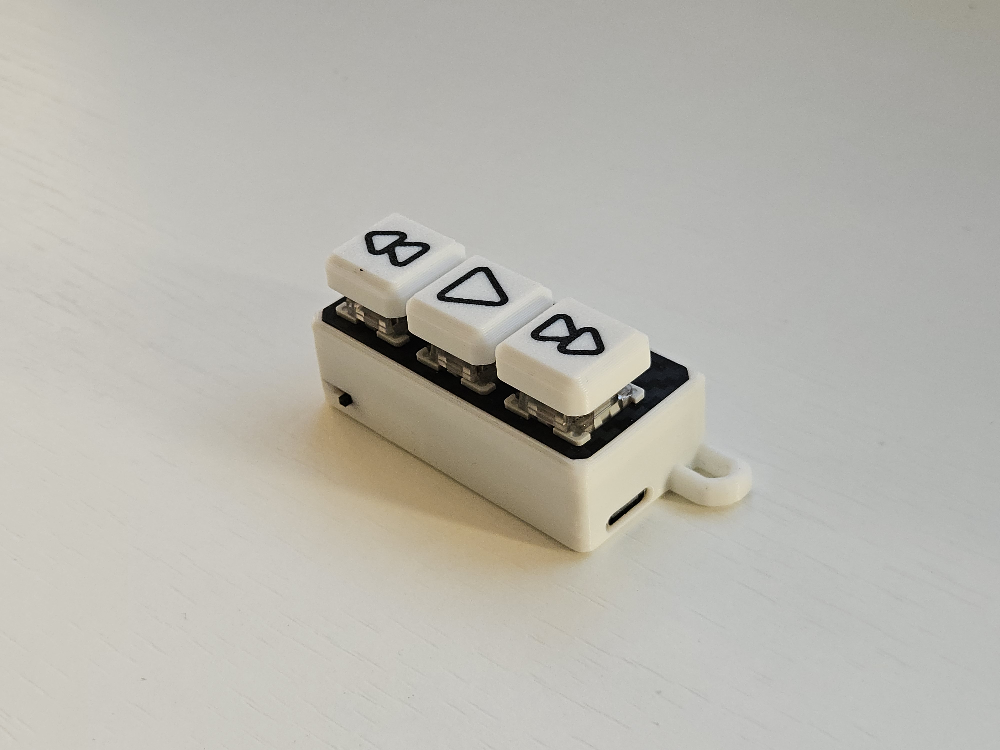

# 3-Key Numpad (Macro Pad)

A sleek, wireless 3-key macro pad built with a Nice!Nano (or clone) and ZMK firmware. Perfect for media controls, hotkeys, or as an E-ink page turner.

## Features
- **Wireless Connectivity**: Bluetooth support via Nice!Nano/NRF52840.
- **Customizable**: Powered by ZMK, easily customizable at [zmk.studio](https://zmk.studio/).
- **Multiple Modes**: Supports multiple firmware configurations (Media, Hotkeys, Page Turner).
- **Premium Design**: Compact case with mechanical switches.

## 3D Printing Files
> [!NOTE]  
> The 3D printing STL/STEP files for this project are available on Makerworld:  
> **[Download 3D Files on Makerworld](https://makerworld.com/en/@Vostok_Labs/upload)**

## FDM Optimized Keycaps
If you want to save on keycaps, I have a model for FDM optimized keycap sets with letters, symbols, and many different custom icons. No supports required!

**[Download Thocky FDM Keycap Set](https://makerworld.com/en/models/2339835-thocky-fdm-optimized-keycap-set-40-no-supports#profileId-2557616)**

## Bill of Materials (BOM)

| Item | Description | Link |
| :--- | :--- | :--- |
| **Controller** | NRF52840 Development Board (Nice!Nano clone) | [AliExpress](https://www.aliexpress.com/item/1005007010555229.html) |
| **Switch** | SS12D00 Slide Switch | [AliExpress](https://www.aliexpress.com/item/33013437240.html) |
| **Battery** | 801350 3.7V Li-Po Battery | [AliExpress](https://www.aliexpress.com/item/1005007117105334.html) |
| **Screws** | BT2x8 Self-tapping Screws (x4) | [Bambu Store](https://eu.store.bambulab.com/products/bt2-socket-head-cap-self-tapping-screws-shcs-new?id=48694574383452) |
| **Switches** | Mechanical Switches (x3) | - |

## Assembly Instructions

1. **Print the Files**: Download and print the plate and casing from Makerworld.
2. **Insert Switches**: Snap your mechanical switches into the printed plate.
3. **Wiring**: Follow the wiring diagram below to connect the switches, battery, and controller.
4. **Flash Firmware**: Flash the desired `.uf2` file to the controller (see [Firmware section](#firmware)).
5. **Final Assembly**: 
   - Place the components into the case.
   - Use a small amount of hot glue to secure the controller and slide switch.
   - Screw the plate onto the case using the BT2x8 screws.
6. **Keycaps**: Add your favorite keycaps to finish the build.

### Wiring Diagram

### Wiring Photo

> [!IMPORTANT]  
> The premade firmware files provided below will **only work** if you wire the device exactly as shown in the wiring diagram above.

---

## Manual & Usage

### First Time Connection
Simply turn on the device and search for it in your Bluetooth settings.

### Pairing with a New Device
1. **Reset Pairing**: Hold all **3 keys** simultaneously for **2 seconds**. The numpad will forget the current device and enter pairing mode.
2. **Connect**: Link it to your new device.
   *Note: The numpad can only be paired with one device at a time.*

### Troubleshooting
If the device fails to reconnect:
- Forget/Unpair the device on your computer/phone.
- Hold all 3 keys for 2 seconds to reset pairing.
- Try connecting again.

### Customization
Go to **[zmk.studio](https://zmk.studio/)** to customize your keymaps. 
**To unlock the numpad for customization, press the top and bottom keys at the same time.**

---

## Firmware

### Flashing Instructions
1. Connect the board to your PC via USB.
2. **Enter Bootloader**: Short the `GND` and `RST` pins twice in quick succession (e.g., using tweezers).
3. **Drag & Drop**: The board will appear as a drive (e.g., `NICENANO`). Drag and drop your chosen `.uf2` file onto the drive.

### Premade Configurations
Check the `firmware/` directory for ready-to-use setups:
- **Media Controls**: Previous, Play/Pause, Next.
- **E-ink Page Turner**: Volume Up, Play/Pause, Volume Down.
- **Hotkeys**: Copy, Paste, Delete.

### Customization & Forking
If you want to alter the firmware for a different controller or a different pinout, feel free to fork the original ZMK config repository:

**[ZMK Config Repository](https://github.com/vostoklabs/zmk-config-3key)**
